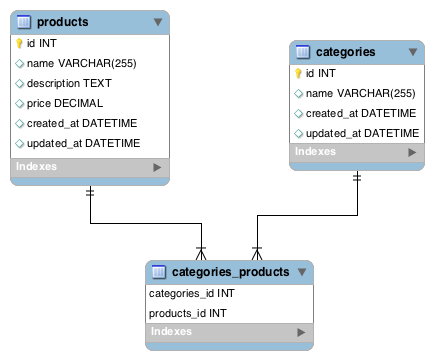
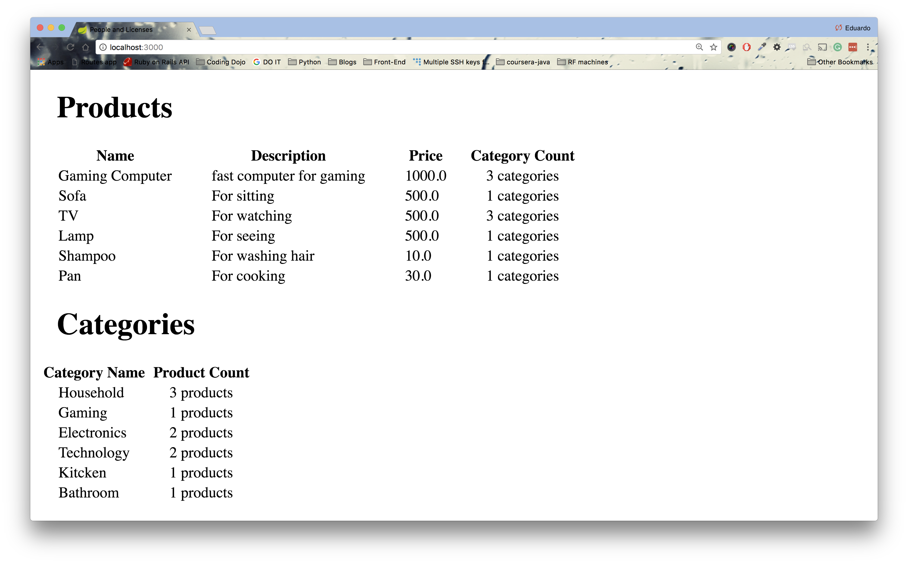

# java_productsAndCategories

## Products and Categories
In this assignment, you will be creating an application that will keep track of products and categories

**ERD and Wireframe**




**Topics:**

● Many-to-Many relationships

● JPA methods

**Tasks:**

● Allow users to create a product.

● Allow users to create a new category.

● In the products show page, allow users to add a category to a specific product.

● In the categories show page, allow users to add a product to a specific category

**.war File**

To test if you have completed this assignment correctly, we have created a project that simply displays all the products with a category count and vice-versa.



First download this .war file: [license-0.0.3-SNAPSHOT.war](https://github.com/itzedu/warFiles/raw/master/license-0.0.3-SNAPSHOT.war). Now, you can run ```java -jar license-0.0.3-SNAPSHOT.war``` and it will start this Spring Boot project on port 3000. Visit localhost:3000 and you should see the picture above but with the information of your database. If not, you have added products and categories incorrectly.